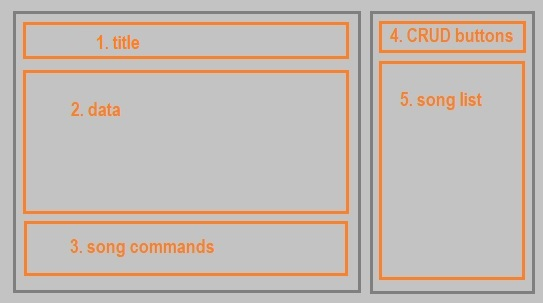

# Video Player README

## Introduction

The purpose of this project is to display music videos and information about them, that it's stored in a database.
In this first version the data has to be manipulated in the database management system. In the next version it
will be done through the program's GUI.   
It's a desktop program made entirely in Python, except for the calls to the DB, made in SQL. In the next section
are listed all the libraries used here.   
The motive of this project is learning, practicing and showing my skills with Python and SQL.

## Installation

The IDE I used is PyCharm Community, but it would work in any IDE that supports Python. The most important in
this project are the modules used. All of them are installed in the same way, using `pip install`. 
The web [Data to Fish](https://datatofish.com/install-package-python-using-pip/) explains how to do it easily.

- [**tkinter**](https://docs.python.org/3/library/tkinter.html)   
This is one of the most used libraries for creating a GUI in Python, as PyQt.
For building the layout there are widgets like buttons, labels or lists that can be embedded in frames.

- [**vlc**](https://www.olivieraubert.net/vlc/python-ctypes/doc/)   
VLC media player is a free desktop app that does exactly what it's name suggests, playing audio and video.
Before installing the module in your python environment it's necessary to
[download](https://www.videolan.org/index.ca.html) first the app.

- [**youtube-dl**](https://pypi.org/project/youtube_dl/)   
This is a bit of polemical module because Youtube is trying to shut it down for copyright infringement.
Around the end of last year (2020) they finally made it, but after a few days it was operative again, and
now, new versions are released constantly. It's main use is to download and/or display Youtube videos.

- [**mysql_connector**](https://pypi.org/project/mysql-connector-python/)   
MySql is the DBMS used to store the information. Besides from the module, it's essential to
[download the MySql/Python Connector](https://dev.mysql.com/downloads/connector/python/), so we
can exchange data from the db to the program and vice versa.

## Functionality

The layout is divided in five frames that correspond to five different functionalities.  
 

##### Version 1.0

All the songs stored in the database will appear on the list (*5*) taking up most part of the right frame.
When a song is selected, the name in the list will be highlighted and all it's data will be shown on
the information frame (*2*). This process consist in a few `SELECT` queries made to the DB. Depending on the song
and artist's name, the result will be different.   
Most part of the information stored is for display purposes, except for the Youtube URL. The pafy module, from
youtube-dl parses the URL and takes the best stream, for later passing it to the vlc API that opens
a new window and plays the video. This can be done from the song commands (*3*), as stopping and
pausing. The two additional buttons are used for navigate to the next or previous song.

> Note: if the URL is empty, misspelled or the video is taken down, the program will raise and error
> when trying to play it.

##### Version 2.0

The other two functions not explained yet, will be available in the next version. But here's a brief explanation
of what is intended to do.   
The title (*1*), that says *"Welcome, user!"* next to the typical user logo, will be customizable. The word *"user"*
will be your user name and the logo a personal image.   
The buttons above the song list (*4*), will be used to make changes to the database without the need of opening
the DBMS. Instead, a window will pop up with entry field in it, to fill with data. The operations will be
`INSERT`, `UPDATE` and `DELETE`. 

## Database

With the intention of separating languages and environments, the DB scripts are in another repository.
There you can find the structure script, a sample data script and the EER diagram. All details
explained in [musicDB](https://github.com/IraiaBB/Music-DB) README.

